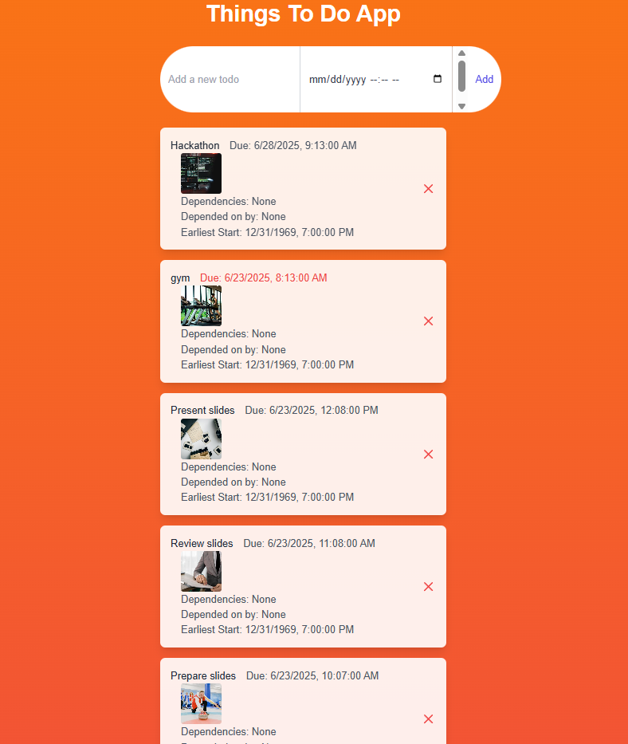
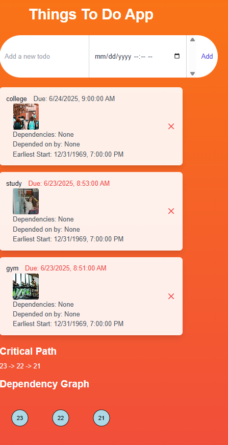
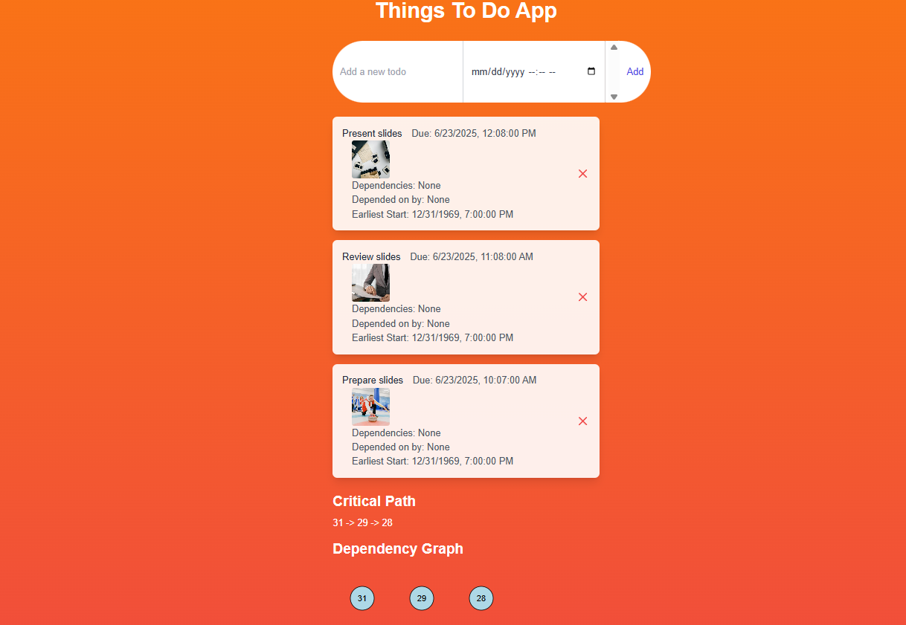

## Soma Capital Technical Assessment

This is a technical assessment as part of the interview process for Soma Capital.

> **IMPORTANT**  
> You will need a Pexels API key to complete the technical assessment portion of the application. You can sign up for a free API key at [https://www.pexels.com/api/](https://www.pexels.com/api/)

To begin, clone this repository to your local machine.

## Development

This is a [NextJS](https://nextjs.org) app with a SQLite-based backend, intended to be run with the LTS version of Node.

### To run the development server:

```bash
npm i
npm run dev
```

## Task

Modify the code to add support for:
- Due dates
- Image previews
- Task dependencies

### Part 1: Due Dates
- When a new task is created, users should be able to set a due date.
- The task list must display the due date.
- If the due date is in the past, it should be shown in **red**.

### Part 2: Image Generation
- When a todo is created, search for and display a relevant image to visualize the task.
- Use the Pexels API with the task description as the search query.
- Show a loading state while fetching the image.
- Display the image once it's loaded.

### Part 3: Task Dependencies
- Allow tasks to have multiple dependencies.
- Prevent circular dependencies.
- Show the critical path.
- Calculate the earliest possible start date based on dependencies.
- Visualize the dependency graph.

---

## Solution

### Due Dates
- Added a `dueDate` input field to the todo creation form in `app/page.tsx`.
- Displayed due dates in the todo list with conditional styling (**red** for past due dates using Tailwind CSS).
- 

### Image Generation
- Integrated the Pexels API in `app/page.tsx` to fetch images based on todo titles.
- Showed "Loading image..." while fetching.
- Displayed the image (16x16px) upon success.
- 

### Task Dependencies
- Added multi-select dropdown for task dependencies.
- Used `graphology` to manage the graph structure and detect cycles.
- Prevented circular dependencies.
- Computed earliest start dates from dependency due dates.
- Calculated the critical path via topological sort.
- Visualized the dependency graph using SVG.
- Introduced `TodoDependency` model with `myDependencies` and `dependsOnMe` relations due to SQLite relational constraints.
- 

---

## Setup

1. Install additional dependencies:

```bash
npm install axios graphology graphology-dag
```

2. Add your Pexels API key to `.env.local`:

```env
NEXT_PUBLIC_PEXELS_API_KEY=place_your_api_key_here
```

3. Run database migrations:

```bash
npx prisma migrate dev
```

4. Start the app:

```bash
npm run dev
```

---

## Submission

1. Add a new **Solution** section to this README with your screenshots or recording.
2. Push your changes to a **public GitHub repository**.
3. Submit the link in the application form.

Thanks for your time and effort. We'll be in touch soon!